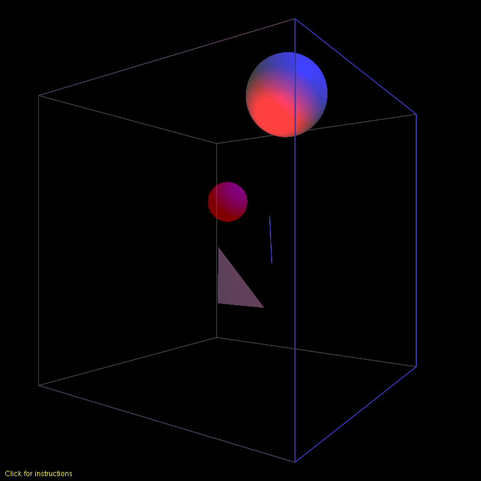

# Graphics in Java using JOGL
#### Created by Zachary Ferguson

**Computer graphics in Java using JOGL**

This repository contains sample Java graphics programming using JOGL. Created
for CS451 Fall 2015 at GMU, the projects cover topics in computer graphics
including 2D and 3D graphics, matrix transformations,
<a href="https://en.wikipedia.org/wiki/Cohen%E2%80%93Sutherland_algorithm"
target="_blank" title="Cohen-Sutherland line clipping">
Cohen-Sutherland line clipping
</a>,
<a href="https://en.wikipedia.org/wiki/Sutherland%E2%80%93Hodgman_algorithm"
target="_blank" title="Sutherland-Hodgman polygon clipping">
Sutherland-Hodgman polygon clipping
</a>, collison detection, 3D lighting, and simple texturing. Included are
batch and bash scripts to compile and run on Windows and Linux respectivly.

